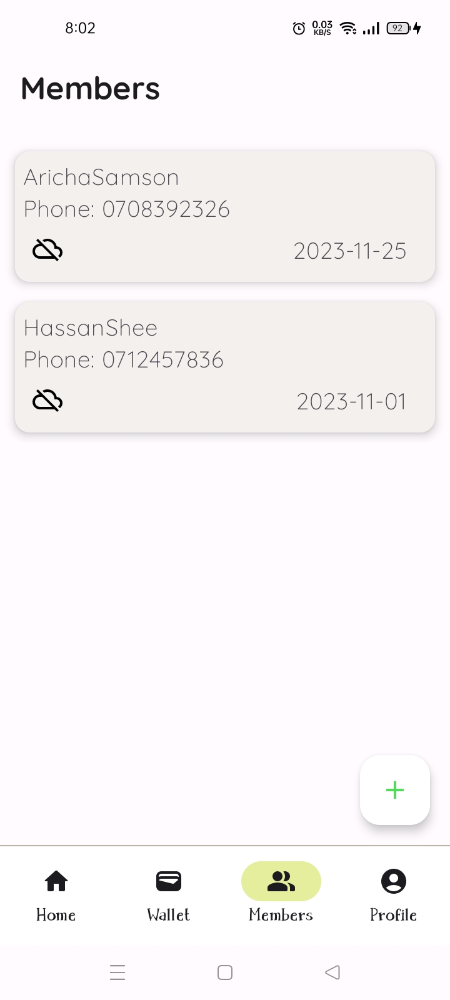

<p align="center"></p>

# ChamaaYetu
ChamaaYetu is a MicroFinance App for the local youths aimed at helping them Manage, Book-keep analyze their Youth Group(Chamaa) organization.
The app is designed to be Offline-First because of the lack of availability of Internet Connection always and the 
need to record as soon as event occurs.

This is a Native Android App made with Kotlin and Jetpack Compose

The Server-Side of the platform is built with Laravel.

## 🛠️ Prerequisites 🛠️
#### IDE
You can either use [IntelliJ IDEA](https://www.jetbrains.com/idea/) or [Android Studio](https://developer.android.com/studio/).


## Screenshots
### Android
        

## Architecture
The app strictly follows the MVVM Architecture with Room and Retrofit as Data Sources and Jetpack Compose as UI.


## Android Technologies used
-   ROOM and Kotlin Flow - Handles local Persistence of Data and asynchronous fetching of data.
-   Retrofit, Kotlinx and OkHttp - Handles Remote Fetching and Updating of Data.
-   Dagger-Hilt - For Dependency Injection.
-   Jetpack Compose - UI.
-   Coroutines - For Concurrency.
-   Jetpack Compose - UI.


## License
```xml
Copyright (c) 2024 Aricha Samson

    Permission is hereby granted, free of charge, to any person obtaining a copy
    of this software and associated documentation files (the "Software"), to deal
    in the Software without restriction, including without limitation the rights
    to use, copy, modify, merge, publish, distribute, sublicense, and/or sell
    copies of the Software, and to permit persons to whom the Software is
    furnished to do so, subject to the following conditions:

    The above copyright notice and this permission notice shall be included in all
    copies or substantial portions of the Software.

    THE SOFTWARE IS PROVIDED "AS IS", WITHOUT WARRANTY OF ANY KIND, EXPRESS OR
    IMPLIED, INCLUDING BUT NOT LIMITED TO THE WARRANTIES OF MERCHANTABILITY,
    FITNESS FOR A PARTICULAR PURPOSE AND NONINFRINGEMENT. IN NO EVENT SHALL THE
    AUTHORS OR COPYRIGHT HOLDERS BE LIABLE FOR ANY CLAIM, DAMAGES OR OTHER
    LIABILITY, WHETHER IN AN ACTION OF CONTRACT, TORT OR OTHERWISE, ARISING FROM,
    OUT OF OR IN CONNECTION WITH THE SOFTWARE OR THE USE OR OTHER DEALINGS IN THE
    SOFTWARE.
```  

  
